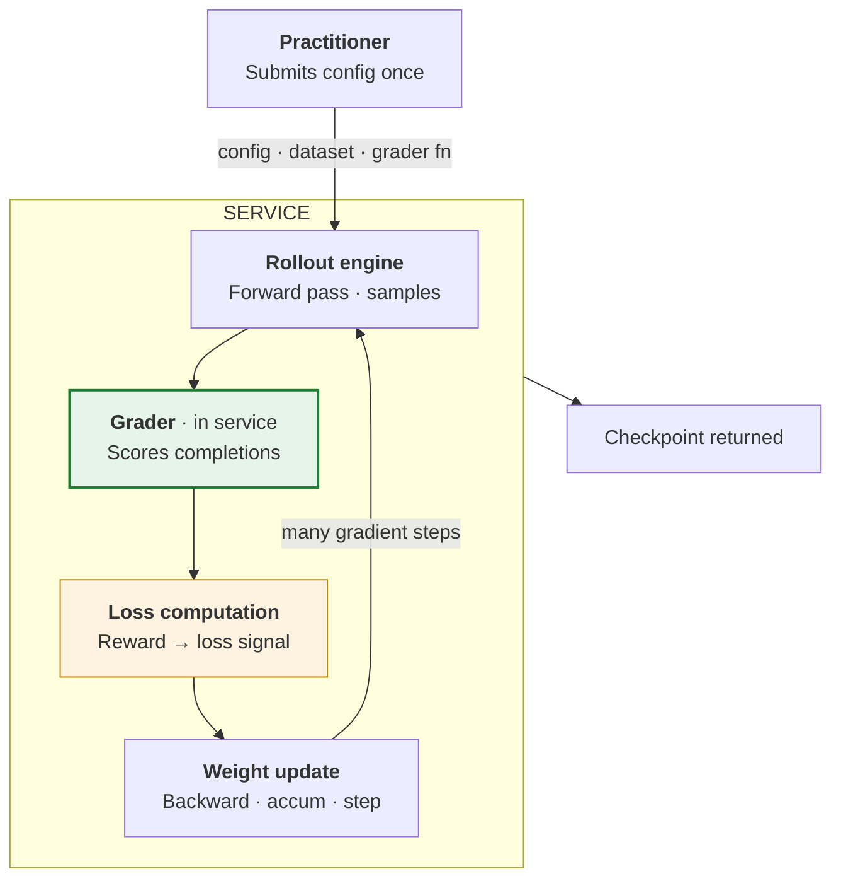
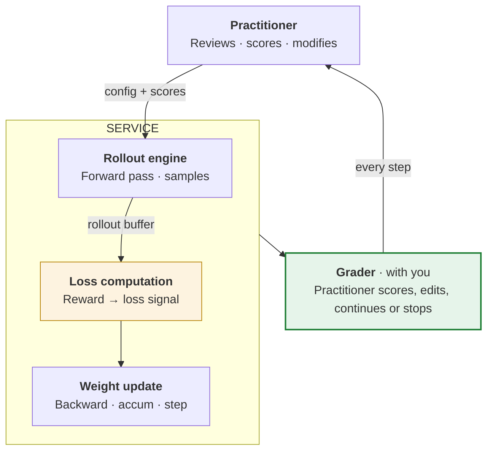
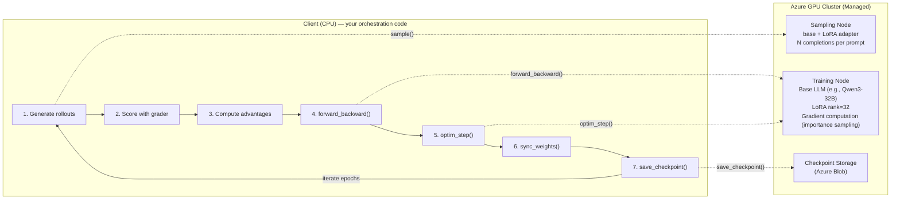
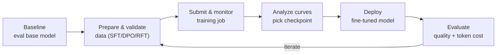

# BRK231 Deploy. Observe. Learn. Reinforcement learning for production agents — Core Update

> The two most important takeaways from BRK231, distilled. Full content preserved in `original_content.md`.

---

## 1. Interactive Training API for RFT

For teams that need **full algorithmic control** over reinforcement fine-tuning.

**What you can bring yourself:**

- **Custom rewards** — your judges, your rubrics, your business rules.
- **Custom rollout environments** — simulators, tool servers, multi-turn worlds.
- **Custom data curation** — your filters, splits, and labeling.
- **Full hyperparameter control** — reasoning effort, compute multiplier, batch size, learning rate.

**Two operating modes side-by-side.** The difference is *where the grader lives and who stays in the loop*: in Path A the grader runs **inside the service** and the whole loop auto-iterates to a checkpoint; in Path B the grader is **with you** and the practitioner re-enters the cycle on **every step**.

### Path A — Managed: Azure OAI RFT / managed fine-tuning

> **Closed loop.** Set it up once; the service iterates until done.

The grader sits **inside the service** — submit once, and rollouts → grader → loss → weight update repeat automatically until a checkpoint is returned.

### Path B — Interactive: Interactive RL / Training API (sneak peek)

> **Open loop.** Practitioner stays in the cycle — scoring, editing, deciding the next step.

The grader is pulled **out of the service and back to you** — after each weight update you score, edit, and decide whether to continue or stop, so you steer the run on every step.

**Inside the interactive Training API:**

Four API calls per step push GPU work to a managed Azure cluster — sampling, gradients, weight sync, checkpoints.

---

## 2. The Fine-Tuning Skill — "so easy a PM can do it"

The common objections:

- *"I don't even know where to start."*
- *"I don't have data to train on, and I don't have time to create it."*
- *"We tried once and it made the base model worse."*
- *"I want to fine-tune. I tried. I'm not seeing results."*

> Most teams that say they'll fine-tune in the next year never ship a tuned model.

**Foundry's fine-tuning skill** takes you from idea → experiment → production — **so easy a PM can do it**. Production traces become datasets in one click; managed RFT closes the loop for you; interactive RL is there when you outgrow it.

### Inside the `microsoft-foundry` skill: the `finetuning` sub-skill

The capability ships as a sub-skill of the **`microsoft-foundry`** skill in the Azure Skills repo:
**[github.com/microsoft/azure-skills → skills/microsoft-foundry/finetuning](https://github.com/microsoft/azure-skills/tree/main/skills/microsoft-foundry/finetuning)**

It fine-tunes models on Azure AI Foundry across **three training types** and covers the full pipeline — dataset prep, training-job submission, deployment, and evaluation.

**Use it for:** fine-tuning (SFT / DPO / RFT), preparing or validating training data, submitting/monitoring/diagnosing jobs, calibrating RFT graders, distillation and synthetic-data generation, large-file uploads, and deploying or evaluating a tuned model.
**Not for:** plain model deployment (use `deploy-model`), agent creation (use `agents`), or prompt-only optimization (use `prompt-optimizer`).

**Three training types — pick by what data you have:**

| Type | Best for | Data needed | Volume | Supported models |
|---|---|---|---|---|
| **SFT** (supervised) | Teaching a new skill or output format | Input–output pairs | 50–5,000 examples | Most models |
| **DPO** (preference) | Aligning tone, style, or safety | Chosen/rejected pairs | 500–5,000 pairs | Select models (can stack on an SFT model) |
| **RFT** (reinforcement) | Improving verifiable reasoning | Prompts + a grading function | 200–2,000 prompts | o4-mini (GPT-5 RFT gated) |

> **Decision shortcut:** Have labeled input–output pairs? → **SFT**. No pairs but can write a grader? → **RFT**. Can only rank "good" vs "bad" outputs? → **DPO**. After SFT: ship it, add **DPO** for style, or add **RFT** when reasoning needs to improve.

**What the sub-skill gives you:**

- **Workflows** — quickstart, full pipeline, dataset creation, iterative training, and diagnosing poor results.
- **References** — training-type selection, hyperparameters, data formats, grader design, reward-hacking avoidance, agentic RFT with tools, deployment, training-curve reading, evaluation, vision FT, large-file uploads, and platform gotchas.
- **Scripts** — `submit_training.py`, `monitor_training.py`, `calibrate_grader.py`, `check_training.py`, `deploy_model.py`, `evaluate_model.py`, `convert_dataset.py`, `generate_distillation_data.py`, `score_dataset.py`, `cleanup.py`, plus per-format data validators.

**Operating rules baked into the skill:**

1. **Baseline first** — evaluate the base model before fine-tuning.
2. **Validate data** before submitting a job.
3. **Calibrate RFT graders** — target a 25–50% failure rate on the base model (train–val gap ≤ 0.05).
4. **Evaluate checkpoints** — don't blindly deploy the final one.
5. **Measure token cost** alongside accuracy when comparing models.

