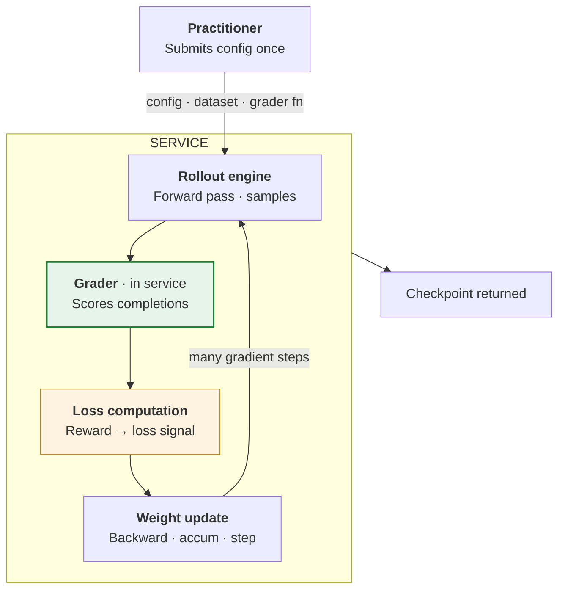
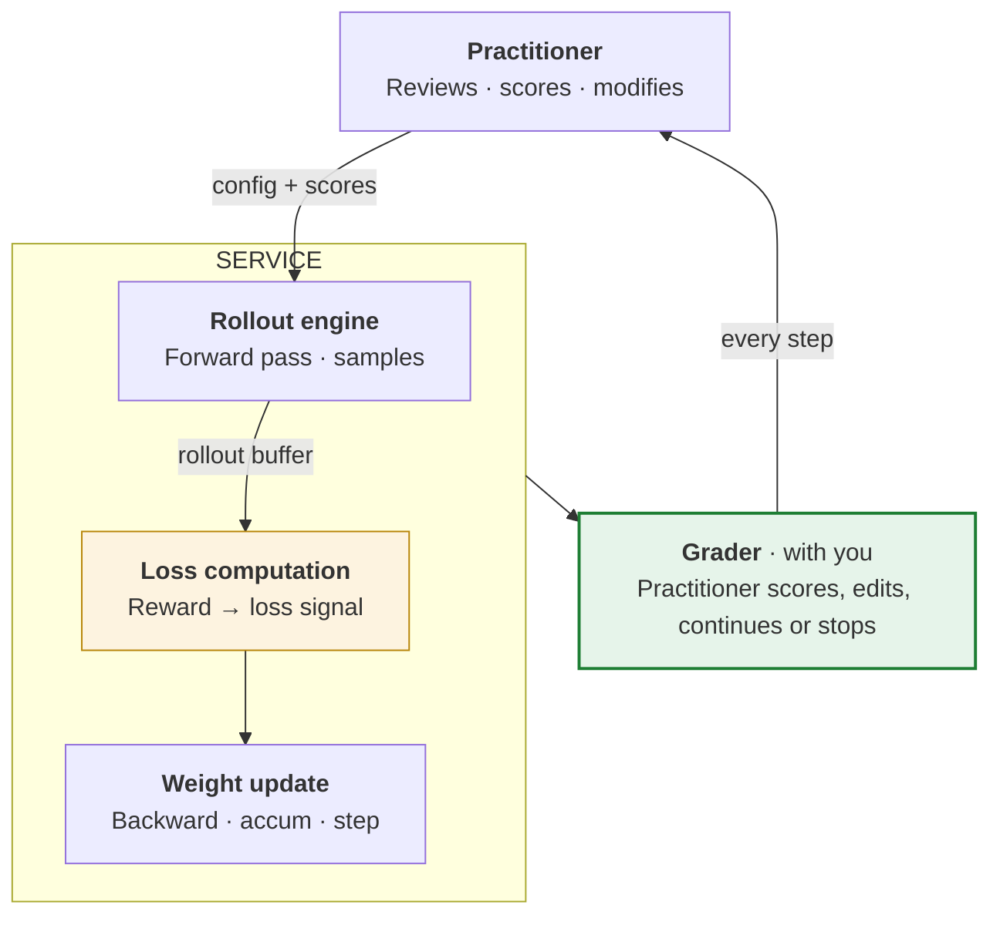
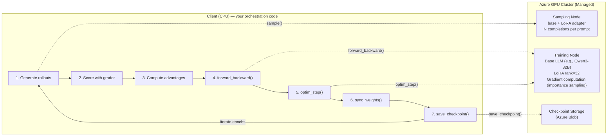

# BRK231 — Core Update

> The two most important takeaways from BRK231, distilled. Full content preserved in `original_content.md`.

---

## 1. Interactive Training API for RFT

For teams that need **full algorithmic control** over reinforcement fine-tuning.

**What you can bring yourself:**

- **Custom rewards** — your judges, your rubrics, your business rules.
- **Custom rollout environments** — simulators, tool servers, multi-turn worlds.
- **Custom data curation** — your filters, splits, and labeling.
- **Full hyperparameter control** — reasoning effort, compute multiplier, batch size, learning rate.

**Two operating modes side-by-side.** The difference is *where the grader lives and who stays in the loop*: in Path A the grader runs **inside the service** and the whole loop auto-iterates to a checkpoint; in Path B the grader is **with you** and the practitioner re-enters the cycle on **every step**.

### Path A — Managed: Azure OAI RFT / managed fine-tuning

> **Closed loop.** Set it up once; the service iterates until done.

The grader sits **inside the service** — submit once, and rollouts → grader → loss → weight update repeat automatically until a checkpoint is returned.

### Path B — Interactive: Interactive RL / Training API (sneak peek)

> **Open loop.** Practitioner stays in the cycle — scoring, editing, deciding the next step.

The grader is pulled **out of the service and back to you** — after each weight update you score, edit, and decide whether to continue or stop, so you steer the run on every step.

**Inside the interactive Training API:**

Four API calls per step push GPU work to a managed Azure cluster — sampling, gradients, weight sync, checkpoints.

---

## 2. The Fine-Tuning Skill — "so easy a PM can do it"

The common objections:

- *"I don't even know where to start."*
- *"I don't have data to train on, and I don't have time to create it."*
- *"We tried once and it made the base model worse."*
- *"I want to fine-tune. I tried. I'm not seeing results."*

> Most teams that say they'll fine-tune in the next year never ship a tuned model.

**Foundry's fine-tuning skill** takes you from idea → experiment → production — **so easy a PM can do it**. Production traces become datasets in one click; managed RFT closes the loop for you; interactive RL is there when you outgrow it.
